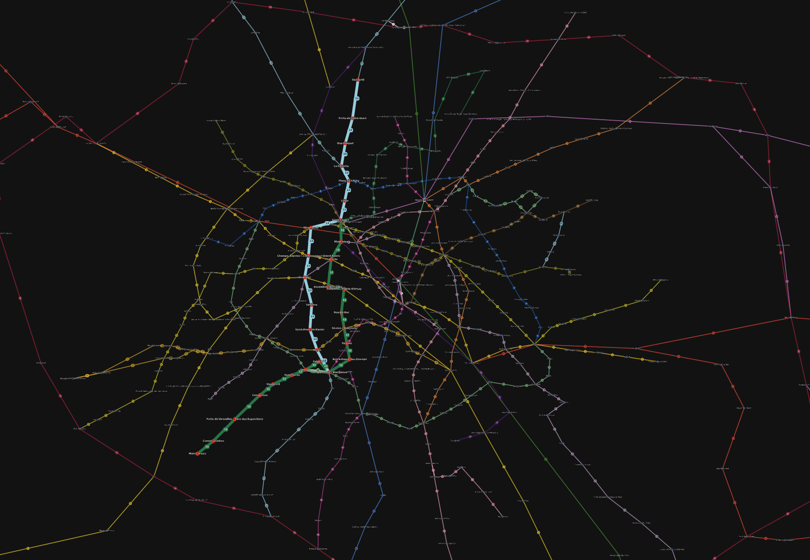

<p align="center">
  <a>
    
  </a>
</p>

<h1 align="center">Public Transports Paris IDF</h1>

<p align="center">
  <p align="center">
    Calculates the shortest paths between two subway station in the Paris public transportation network.
  </p>  
  <p align="center">
    (includes RER and Metro only)
  </p>  
  <p align="center">
    <a href="https://github.com/hugo-HDSF/public_transports_paris_idf/blob/main/transports_paths.svg"><strong>View Exemple »</strong></a>
    .
    <a href="https://github.com/hugo-HDSF/public_transports_paris_idf/issues">Report Bug</a>
    .
    <a href="https://github.com/hugo-HDSF/public_transports_paris_idf/issues">Request Feature</a>
    .
      
  </p>
</p>

<div align="center">


</div>
<div align="center">


</div>

-----

## Table Of Contents

* [About the Project](#about-the-project)
* [Built With](#built-with)
* [Data Sources](#data-source)
* [Getting Started](#getting-started)
    * [Prerequisites](#prerequisites)
    * [Installation](#installation)
* [Usage](#usage)
    * [Target and Source variables](#target-and-source-variables)
    * [Control variables](#control-variables)
* [Roadmap](#roadmap)
* [Contributing](#contributing)
* [License](#license)
* [Authors](#authors)
* [Acknowledgements](#acknowledgements)

## About The Project



This project visualizes the shortest paths between two subway stations in the Paris public transportation network (RER and Metro only). It leverages NetworkX, a powerful library for working with
networks and graphs, to process and analyze the underlying subway network data. The output is a high-resolution SVG image that highlights the shortest path and includes relevant information about the
stations and the lines.

## Built With

* [Python](https://www.python.org/)
* [NetworkX](https://networkx.org/)
* [Matplotlib](https://matplotlib.org/)

## Data Source

* [Data.gouv.fr](https://www.data.gouv.fr/fr/)

### Transports List

#### RER

Added :
<p>
  <span style="white-space:normal">
  <span data-sort-value="A !"></span>
  <span data-sort-value="B !"></span>
  <span data-sort-value="C !"></span>
  <span data-sort-value="D !"></span>
  <span data-sort-value="E !"></span>
  </span>
</p>

#### Metro

Added :
<p>
<span style="white-space:normal">
<span data-sort-value="01 !"></span>
<span data-sort-value="02 !"></span>
<span data-sort-value="03 !"></span>
<span data-sort-value="03bis !"></span>
<span data-sort-value="04 !"></span>
<span data-sort-value="05 !"></span>
<span data-sort-value="06 !"></span>
<span data-sort-value="07 !"></span>
<span data-sort-value="07bis !"></span>
<span data-sort-value="08 !"></span>
<span data-sort-value="09 !"></span>
<span data-sort-value="10 !"></span>
<span data-sort-value="11 !"></span>
<span data-sort-value="12 !"></span>
<span data-sort-value="13 !"></span>
<span data-sort-value="14 !"></span>
<span data-sort-value="15 !"></span>
</span>
</p>

to add :
<p>
<span style="white-space:normal">
<span data-sort-value="16 !"></span><a href="/wiki/Ligne_16_du_m%C3%A9tro_de_Paris" title="Ligne 16 du métro de Paris"></a>
<span data-sort-value="17 !"></span><a href="/wiki/Ligne_17_du_m%C3%A9tro_de_Paris" title="Ligne 17 du métro de Paris"></a>
<span data-sort-value="18 !"></span><a href="/wiki/Ligne_18_du_m%C3%A9tro_de_Paris" title="Ligne 18 du métro de Paris"></a>
</span>
</p>

## Getting Started

To get a local copy up and running, follow these simple steps:

### Prerequisites

Ensure you have Python 3.9+ installed on your system. You can check your Python version by running:

```sh
python --version
```

### Installation

1. Clone the repository
```sh
git clone https://github.com/hugo-HDSF/public_transports_paris_idf.git
```
3. Create a virtual environment (optional). we recommend using Pycharm built in virtual environment.
>PyCharm makes it possible to use the virtualenv tool to create a project-specific isolated virtual environment. Follow [instructions](https://www.jetbrains.com/help/pycharm/creating-virtual-environment.html).
4. Install the required packages. (all packages are listed in the [main.py](main.py) file)
>We recommend to try out the new Jetbrains UI and their new redesigned packaging manager support in Python Packages Pycharm tool window. Follow [instructions](https://www.jetbrains.com/help/pycharm/installing-uninstalling-and-upgrading-packages.html).
## Usage

### Target and Source variables

Visit the [updated_data.json](updated_data.json) file to see the subway station structure. Select both source and target stations and set global variables according to your chose at the start of the
script:

```source = "garibaldi"```

```target = "mairie d'issy"```

Then run the [main.py](main.py) python script with the according python interpreter configuration.
It will then calculate the shortest paths between these stations and generate a high-resolution SVG image in the same directory.

### Control variables

Set to True if you want to see multiple path options:

```multiple_path_options = True```

set the weight of the changing line penality according to your preferences:

```changing_line_penality = 300```

Set the weight of the walking to nearest station reward (makes sur the algorithm considers station connections as easy paths, we recommend setting it to the sum of the node and edge weight to balance
weight cost):

```walking_to_nearest_station_reward = 55```

Set the weight of the nodes:

```node_weight = 5```

Set the weight of the edges:

```edge_weight = 50```

## Roadmap

See the [open issues](https://github.com/hugo-HDSF/public_transports_paris_idf/issues) for a list of proposed features (and known issues).

## Contributing

Contributions are what make the open source community such an amazing place to be learn, inspire, and create. Any contributions you make are **greatly appreciated**.

* If you have suggestions for adding or removing projects, feel free to [open an issue](https://github.com/hugo-HDSF/public_transports_paris_idf/issues/new) to discuss it, or directly create a pull request
  after you edit the [*README.md*](README.md) file with necessary changes.
* Please make sure you check your spelling and grammar.
* Create individual PR for each suggestion.

## License

Distributed under the MIT License.

## Authors

* **DA SILVA Hugo** - *Student - Fullstack Developer* - [Github](https://github.com/hugo-HDSF/)
* **MOHAMMEDI Tayeb** - *Student - Fullstack Developer* - Github

## Acknowledgements

* [Paris Nanterre University](https://www.parisnanterre.fr/)
* [Data.gouv.fr](https://www.data.gouv.fr/fr/)
* [Img Shields](https://shields.io/)
* [Simple Icons](https://simpleicons.org/)
* [Readme Generator](https://readme.shaankhan.dev/)

###### _Study Project | (BACHELOR) 2022-2023_
